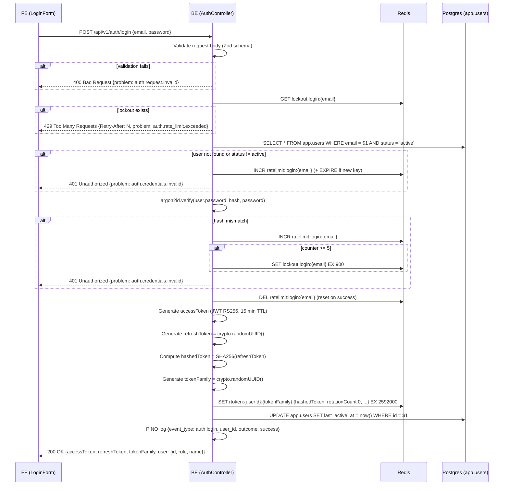
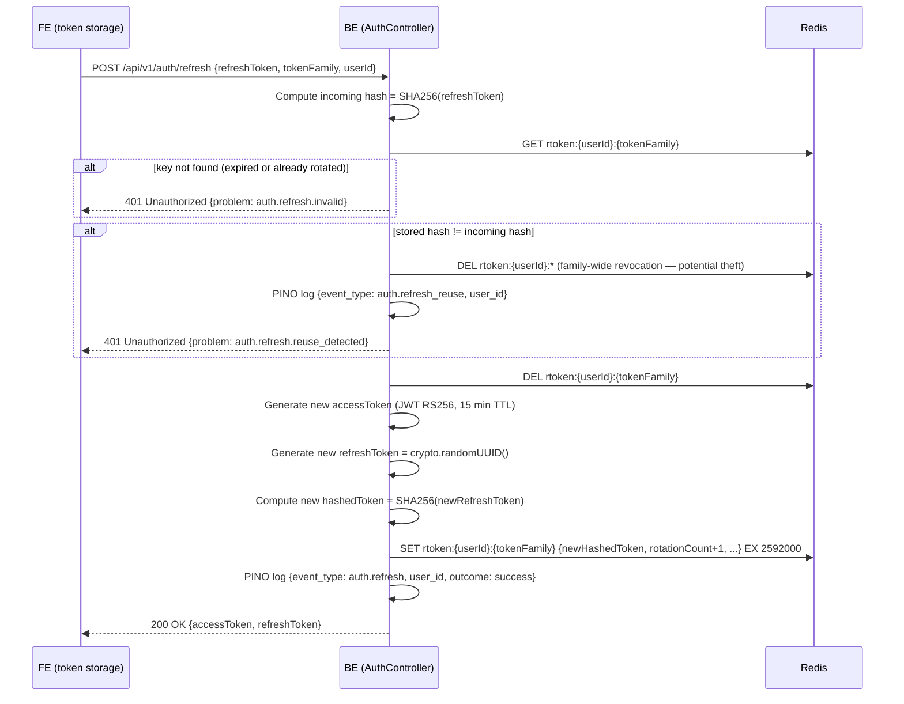
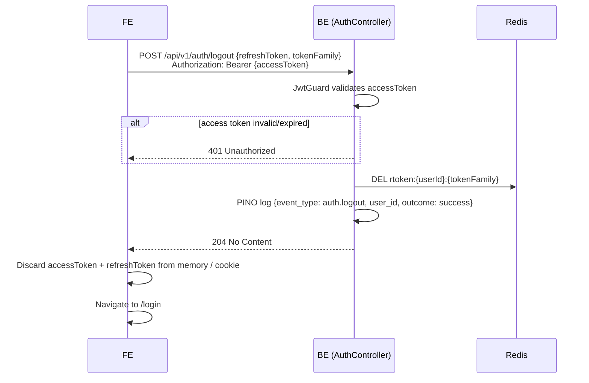
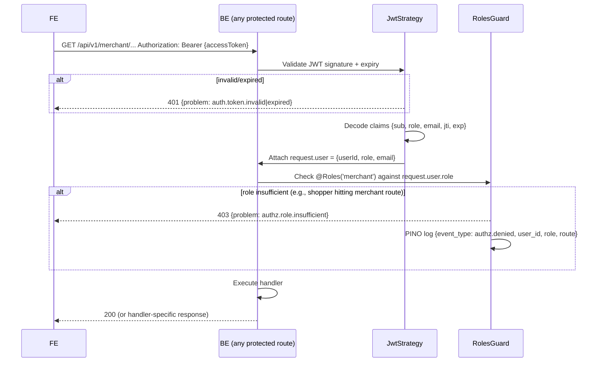

# Business Logic Model — UoW-02 Auth + Role Gate

**Generated**: 2026-05-04T00:33:00Z
**Stage**: 8 — Functional Design
**UoW**: UoW-02 — Auth + role gate

---

## Workflow 1: Login (`POST /api/v1/auth/login`)



**Text alternative**: The FE posts email + password. The BE first checks for a lockout in Redis. If locked out, it returns 429. Otherwise it loads the user from Postgres, verifies the argon2id hash, and on mismatch increments a Redis rate-limit counter (locking after 5 failures). On success it generates a JWT access token and an opaque refresh token (stored as SHA-256 in Redis), resets the rate-limit counter, updates `last_active_at` in Postgres, emits a pino auth.login log, and returns both tokens to the FE.

---

## Workflow 2: Token Refresh (`POST /api/v1/auth/refresh`)



**Text alternative**: The FE sends the refresh token, token family, and userId. The BE hashes the incoming refresh token and looks up the Redis entry. If not found (expired), returns 401. If hashes don't match (replayed old token), revokes all token families for the user (theft response) and returns 401. On valid match, deletes the old entry, issues new access + refresh tokens into the same family with incremented rotation count, and returns them.

---

## Workflow 3: Logout (`POST /api/v1/auth/logout`)



**Text alternative**: The FE sends the access token (for auth) and the refresh token + family to revoke. The BE validates the access token, deletes the refresh token family from Redis, logs the event, and returns 204. The FE is responsible for discarding both tokens and navigating to the login page.

---

## Workflow 4: Authenticated request with RoleGuard



**Text alternative**: Every protected route passes through JwtStrategy (validates the RS256 signature and expiry), which attaches the decoded user claims to the request. RolesGuard then checks if the user's role satisfies the decorator-declared required roles. If not, a 403 is returned and the denial is logged. Admin role bypasses all role checks.

---

## State Machine: User.status transitions

```
         ┌─────────────────────────────────────────┐
         │                                         │
         ▼                                         │
    [active] ──── admin disables ────► [disabled] ─┤
         │                                         │
         │                                 admin re-enables
         │                                         │
         └──── retention sweep (12 mo) ──► [anonymized]
                  (PII scrubbed; irreversible)
```

**Text alternative**: A user starts as `active`. An admin can move them to `disabled` (reversible via re-enable). After 12 months of inactivity, a retention sweep moves them to `anonymized` (irreversible — PII fields nulled/scrubbed). Both `disabled` and `anonymized` users are rejected at login.

---

## API Contract (UoW-02 endpoints — added to `shared/openapi.yaml`)

### POST /api/v1/auth/login
- **Request**: `{ email: string, password: string }`
- **Responses**:
  - `200`: `{ accessToken: string, refreshToken: string, tokenFamily: string, user: { id: string, role: 'shopper'|'merchant'|'admin', name: string|null } }`
  - `400`: Problem (auth.request.invalid)
  - `401`: Problem (auth.credentials.invalid | auth.account.disabled)
  - `429`: Problem (auth.rate_limit.exceeded) + `Retry-After` header

### POST /api/v1/auth/refresh
- **Request**: `{ refreshToken: string, tokenFamily: string, userId: string }`
- **Responses**:
  - `200`: `{ accessToken: string, refreshToken: string }`
  - `401`: Problem (auth.refresh.invalid | auth.refresh.reuse_detected)

### POST /api/v1/auth/logout
- **Security**: BearerAuth (JWT)
- **Request**: `{ refreshToken: string, tokenFamily: string }`
- **Responses**:
  - `204`: (no body)
  - `401`: Problem (auth.token.invalid | auth.token.expired)

---

## Seeding (UoW-02 dev tooling)

Since UoW-02 does not implement a signup endpoint, three seed users are created by `scripts/seed.ts` (dev-only):

| Email | Password | Role |
|-------|----------|------|
| shopper@example.com | TestShopper12345 | shopper |
| merchant@example.com | TestMerchant12345 | merchant |
| admin@example.com | TestAdmin12345 | admin |

Seed passwords meet BR-AUTH-002 (≥ 12 chars). Seed script: hashes via argon2id (same BR-AUTH-003 params), inserts into `app.users`. Only runs when `NODE_ENV=development`.
