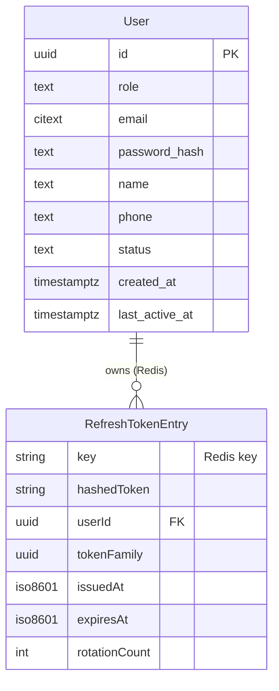

# Domain Entities — UoW-02 Auth + Role Gate

**Generated**: 2026-05-04T00:33:00Z
**Stage**: 8 — Functional Design
**UoW**: UoW-02 — Auth + role gate (NestJS AuthModule + login/refresh API + FE login form)
**Stories**: SH-01, MR-01 (auth parts), CC-03 (audit log for writes)
**Scope**: BE (NestJS) + FE (Next.js login page)

---

## Entity 1: User

**Purpose**: Role-aware account for all three actor types (shopper, merchant, admin).

| Field | Type | Nullable | Constraints | Notes |
|-------|------|----------|-------------|-------|
| id | UUID | No | PK, server-generated (`gen_random_uuid()`) | Immutable after creation |
| role | TEXT | No | CHECK IN ('shopper','merchant','admin') | Set at account creation; immutable (no self-service role change in MVP) |
| email | CITEXT | No | UNIQUE, NOT NULL, ≤ 254 chars (RFC 5321), lowercased by CITEXT | Encrypted at rest (NFR-SEC-01); used as login identifier |
| password_hash | TEXT | No | NOT NULL | argon2id hash; raw password never stored (BR-AUTH-003) |
| name | TEXT | Yes | ≤ 120 chars | Encrypted at rest (NFR-SEC-01); nullable on creation |
| phone | TEXT | Yes | E.164 format if provided | Encrypted at rest (NFR-SEC-01) |
| status | TEXT | No | NOT NULL DEFAULT 'active', CHECK IN ('active','disabled','anonymized') | 'disabled' = admin-blocked; 'anonymized' = PII scrubbed after retention window |
| created_at | TIMESTAMPTZ | No | NOT NULL DEFAULT now() | Immutable |
| last_active_at | TIMESTAMPTZ | Yes | | Updated on successful login; drives 12-month PII retention sweep (NFR-PRIV-03) |

**Relationships** (UoW-02 scope — full relationships established in UoW-03+):
- has many `conversations` (FK established at UoW-03)
- has many `orders` (FK established at UoW-03)
- has one open `cart` (FK established at UoW-03)

**Lifecycle**:
1. `active` — normal operating state; all endpoints available
2. `disabled` — admin-blocked; login rejected with `auth.account.disabled`
3. `anonymized` — PII fields set to NULL/scrubbed; `status='anonymized'`; account is a tombstone; login rejected with `auth.account.disabled`

**Indexes (UoW-02 scope)**:
- `UNIQUE INDEX users_email_idx ON app.users (email)` — login lookup (CITEXT handles case folding)
- `INDEX users_last_active_at_idx ON app.users (last_active_at)` — retention sweep

**Security classification**: RESTRICTED (contains authentication credentials + PII name/phone)
**Prisma migration**: `UoW-02-001-create-users-table`

---

## Entity 2: RefreshTokenEntry (Redis — not persisted in Postgres)

**Purpose**: Store refresh token metadata in Redis for token rotation, revocation, and reuse detection.

| Field | Type | Notes |
|-------|------|-------|
| key | STRING | Redis key: `rtoken:{userId}:{tokenFamily}` |
| hashedToken | STRING | SHA-256 hex of the raw refresh-token UUID (raw token never stored) |
| userId | UUID | Owner; used for family-wide revocation |
| tokenFamily | UUID | Logical family for this rotation chain; reuse of a superseded token in the same family = theft signal |
| issuedAt | ISO8601 | When this entry was issued |
| expiresAt | ISO8601 | When this entry expires (30-day TTL from issue; sliding — reset on each rotation) |
| rotationCount | INTEGER | Monotone counter; incremented on each refresh; used for diagnostics |

**TTL**: 30 days (sliding — each successful `POST /api/v1/auth/refresh` resets TTL to 30 days from now)

**Revocation strategies**:
- Single-token revocation (logout): `DEL rtoken:{userId}:{tokenFamily}`
- Family-wide revocation (reuse detection): `DEL rtoken:{userId}:*` (keys pattern scan — acceptable at MVP scale; replace with set-based at scale)
- All-token revocation (admin disable): `DEL rtoken:{userId}:*`

**Security note**: Redis must be password-protected (`requirepass`) and not exposed publicly. In local dev `infra/docker-compose.yml` Redis is LAN-only. Production: managed Redis with TLS + auth (established at Stage 16 IaC).

---

## ER Diagram (UoW-02 scope)

**Text alternative**: The User entity owns zero or more RefreshTokenEntry records stored in Redis (not Postgres). Each entry belongs to a token rotation family. The User entity is persisted in Postgres `app.users` with a CITEXT email column and argon2id password_hash.
