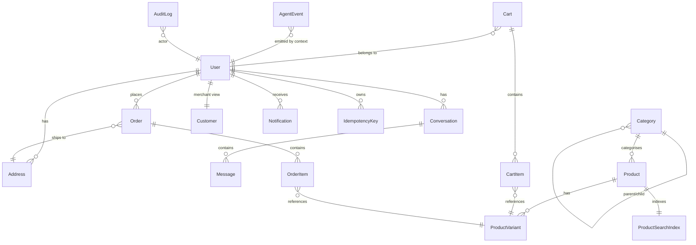

# Domain Entities — UoW-03 (Persistence + Audit Log + Idempotency + Outbox)

**Stack**: BE + DB  **Milestone**: M1  **Story**: CC-03

---

## Entity: Address

**Purpose**: Shipping or billing address belonging to a user.

| Field | Type | Constraints | Notes |
|-------|------|-------------|-------|
| id | UUID | PK | server-generated |
| userId | UUID | FK → users(id), NOT NULL | cascades: on user delete, set null or cascade |
| type | TEXT | CHECK (type IN ('shipping','billing')), NOT NULL | |
| line1 | TEXT | NOT NULL | encrypted at rest (NFR-SEC-01) |
| line2 | TEXT | nullable | encrypted at rest |
| city | TEXT | NOT NULL | encrypted at rest |
| state | TEXT | NOT NULL | encrypted at rest |
| postalCode | TEXT | NOT NULL | encrypted at rest |
| countryCode | TEXT | NOT NULL, length=2 | ISO 3166-1 alpha-2 |
| createdAt | TIMESTAMPTZ | NOT NULL, default now() | |
| updatedAt | TIMESTAMPTZ | NOT NULL, default now() | |

**Relationships**: belongs to `User` (many addresses per user).

---

## Entity: Conversation

**Purpose**: A chat session between a user and the agent system.

| Field | Type | Constraints | Notes |
|-------|------|-------------|-------|
| id | UUID | PK | server-generated |
| userId | UUID | FK → users(id), NOT NULL | |
| startedAt | TIMESTAMPTZ | NOT NULL, default now() | |
| lastActivityAt | TIMESTAMPTZ | NOT NULL, default now() | drives transcript retention (NFR-PRIV-03) |

**Relationships**: belongs to `User`; has many `Messages`.

**Lifecycle**: Created on first message. `lastActivityAt` updated on every new message. Transcripts deleted after 6 months per retention policy.

---

## Entity: Message

**Purpose**: A single chat turn — user text, agent response, or system event.

| Field | Type | Constraints | Notes |
|-------|------|-------------|-------|
| id | UUID | PK | server-generated |
| conversationId | UUID | FK → conversations(id), NOT NULL | |
| sender | TEXT | CHECK (sender IN ('user','agent','system')), NOT NULL | |
| senderRole | TEXT | CHECK (senderRole IN ('shopper','merchant','admin')), nullable | |
| content | TEXT | nullable | plain text; encrypted at rest (PII per BR § 2.8) |
| widgetPayload | JSONB | nullable | structured widget JSON for agent turns |
| agentName | TEXT | nullable | e.g., 'product_agent' |
| createdAt | TIMESTAMPTZ | NOT NULL, default now() | indexed for retention sweep |

**Relationships**: belongs to `Conversation`.

---

## Entity: Category

**Purpose**: Product taxonomy node (hierarchical).

| Field | Type | Constraints | Notes |
|-------|------|-------------|-------|
| id | UUID | PK | server-generated |
| name | TEXT | NOT NULL | |
| slug | TEXT | UNIQUE, NOT NULL | URL-safe identifier |
| parentId | UUID | FK → categories(id), nullable | null = root category |
| createdAt | TIMESTAMPTZ | NOT NULL, default now() | |

**Relationships**: self-referencing tree (parent → children).

---

## Entity: Product

**Purpose**: A merchant's product listing.

| Field | Type | Constraints | Notes |
|-------|------|-------------|-------|
| id | UUID | PK | server-generated |
| title | TEXT | NOT NULL | |
| description | TEXT | nullable | |
| priceCents | INTEGER | NOT NULL, CHECK (priceCents >= 0) | INR paise |
| currency | TEXT | NOT NULL, default 'INR' | en-IN MVP |
| categoryId | UUID | FK → categories(id), nullable | |
| status | TEXT | CHECK (status IN ('active','archived')), NOT NULL, default 'active' | soft-delete |
| imageUrls | TEXT[] | NOT NULL, default '{}' | |
| createdByUserId | UUID | FK → users(id), NOT NULL | merchant who listed |
| createdAt | TIMESTAMPTZ | NOT NULL, default now() | |
| updatedAt | TIMESTAMPTZ | NOT NULL, default now() | |

**Relationships**: belongs to `Category`; created by `User`; has many `ProductVariants`; has one `ProductSearchIndex`.

**Lifecycle**: `status=active` → `archived` (soft delete via Product Agent).

---

## Entity: ProductVariant

**Purpose**: A specific SKU variant of a product (size, colour, etc.) with its own stock level.

| Field | Type | Constraints | Notes |
|-------|------|-------------|-------|
| id | UUID | PK | server-generated |
| productId | UUID | FK → products(id), NOT NULL | |
| sku | TEXT | UNIQUE, NOT NULL | |
| attributes | JSONB | NOT NULL, default '{}' | e.g., `{"size":"M","color":"red"}` |
| stock | INTEGER | NOT NULL, CHECK (stock >= 0) | |
| lowStockThreshold | INTEGER | NOT NULL, default 5 | drives FR-NOTIF-02 |
| createdAt | TIMESTAMPTZ | NOT NULL, default now() | |
| updatedAt | TIMESTAMPTZ | NOT NULL, default now() | |

**Relationships**: belongs to `Product`; referenced by `CartItem` and `OrderItem`.

---

## Entity: ProductSearchIndex

**Purpose**: pgvector embedding + tsvector for semantic + keyword product search.

| Field | Type | Constraints | Notes |
|-------|------|-------------|-------|
| productId | UUID | PK, FK → products(id) | one row per product |
| embedding | VECTOR(1536) | nullable | populated by embedding worker |
| textBlob | TEXT | NOT NULL | concatenated title + desc + category name |
| tsv | TSVECTOR | generated / maintained | for keyword fallback |
| updatedAt | TIMESTAMPTZ | NOT NULL, default now() | rebuilt by embedding-rebuild consumer |

**Indexes**: `ivfflat (embedding vector_cosine_ops) WITH (lists=100)` + `gin(tsv)`.

---

## Entity: Cart

**Purpose**: An open shopping cart — at most one per shopper.

| Field | Type | Constraints | Notes |
|-------|------|-------------|-------|
| id | UUID | PK | server-generated |
| userId | UUID | FK → users(id), UNIQUE WHERE status='open' | enforces one open cart |
| status | TEXT | CHECK (status IN ('open','converted','abandoned')), NOT NULL, default 'open' | |
| createdAt | TIMESTAMPTZ | NOT NULL, default now() | |
| updatedAt | TIMESTAMPTZ | NOT NULL, default now() | |

**Relationships**: belongs to `User`; has many `CartItems`.

---

## Entity: CartItem

**Purpose**: A line item in a cart.

| Field | Type | Constraints | Notes |
|-------|------|-------------|-------|
| id | UUID | PK | server-generated |
| cartId | UUID | FK → carts(id), NOT NULL | |
| variantId | UUID | FK → product_variants(id), NOT NULL | |
| quantity | INTEGER | NOT NULL, CHECK (quantity > 0) | |
| addedAt | TIMESTAMPTZ | NOT NULL, default now() | |

**Relationships**: belongs to `Cart`; references `ProductVariant`.

---

## Entity: Order

**Purpose**: A placed shopper order with frozen pricing.

| Field | Type | Constraints | Notes |
|-------|------|-------------|-------|
| id | UUID | PK | server-generated |
| userId | UUID | FK → users(id), NOT NULL | the shopper |
| status | TEXT | CHECK (status IN ('placed','paid','fulfilled','shipped','delivered','cancelled','refunded','returned')), NOT NULL | |
| totalCents | INTEGER | NOT NULL, CHECK (totalCents >= 0) | |
| currency | TEXT | NOT NULL, default 'INR' | |
| shippingAddressId | UUID | FK → addresses(id), nullable | nullable in simulated MVP |
| paymentRef | TEXT | nullable | simulated in MVP |
| trackingNumber | TEXT | nullable | |
| trackingCarrier | TEXT | nullable | |
| placedAt | TIMESTAMPTZ | NOT NULL, default now() | |
| lastStatusChangeAt | TIMESTAMPTZ | NOT NULL, default now() | |

**Relationships**: belongs to `User`; has many `OrderItems`; belongs to `Address` (shipping).

**Lifecycle**: `placed` → `paid` → `fulfilled` → `shipped` → `delivered`; or `cancelled` / `refunded` / `returned` from eligible statuses.

---

## Entity: OrderItem

**Purpose**: A frozen line item in an order (price captured at purchase time).

| Field | Type | Constraints | Notes |
|-------|------|-------------|-------|
| id | UUID | PK | server-generated |
| orderId | UUID | FK → orders(id), NOT NULL | |
| variantId | UUID | FK → product_variants(id), NOT NULL | |
| quantity | INTEGER | NOT NULL, CHECK (quantity > 0) | |
| priceAtPurchaseCents | INTEGER | NOT NULL, CHECK (priceAtPurchaseCents >= 0) | frozen at order creation |

**Relationships**: belongs to `Order`; references `ProductVariant`.

---

## Entity: Customer

**Purpose**: Merchant-view of a shopper — tags, segments, LTV, order count.

| Field | Type | Constraints | Notes |
|-------|------|-------------|-------|
| id | UUID | PK | server-generated |
| userId | UUID | FK → users(id), UNIQUE, NOT NULL | the underlying shopper |
| tags | TEXT[] | NOT NULL, default '{}' | merchant-applied |
| segments | TEXT[] | NOT NULL, default '{}' | derived (e.g., 'high-ltv') |
| ltvCents | INTEGER | NOT NULL, default 0, CHECK (ltvCents >= 0) | recalculated by `customer-ltv-recalc` consumer |
| orderCount | INTEGER | NOT NULL, default 0, CHECK (orderCount >= 0) | |
| createdAt | TIMESTAMPTZ | NOT NULL, default now() | |
| updatedAt | TIMESTAMPTZ | NOT NULL, default now() | |

**Relationships**: belongs to `User` (one-to-one).

---

## Entity: Notification

**Purpose**: In-app notifications for merchants (new orders, low stock, etc.).

| Field | Type | Constraints | Notes |
|-------|------|-------------|-------|
| id | UUID | PK | server-generated |
| recipientUserId | UUID | FK → users(id), NOT NULL | merchant role in MVP |
| type | TEXT | CHECK (type IN ('new_order','low_stock','customer_action','system')), NOT NULL | |
| payload | JSONB | NOT NULL | event-specific data |
| readAt | TIMESTAMPTZ | nullable | NULL = unread |
| createdAt | TIMESTAMPTZ | NOT NULL, default now() | |

**Relationships**: belongs to `User` (recipient).

---

## Entity: AgentEvent (Outbox)

**Purpose**: Transactional outbox record — domain mutations write here in the same transaction; the outbox drain worker forwards to Redis Streams.

| Field | Type | Constraints | Notes |
|-------|------|-------------|-------|
| id | UUID | PK | server-generated |
| eventType | TEXT | NOT NULL | e.g., 'order.created', 'product.stock_changed' |
| payload | JSONB | NOT NULL | full event payload |
| emittedByModule | TEXT | NOT NULL | e.g., 'order_agent' |
| consumedBy | TEXT[] | NOT NULL, default '{}' | append-only list of consumer names that ACKed |
| committedToStreamAt | TIMESTAMPTZ | nullable | NULL = pending drain; set by drain worker |
| createdAt | TIMESTAMPTZ | NOT NULL, default now() | |

**Lifecycle**: Written in same DB transaction as the domain mutation → drain worker sets `committedToStreamAt` → can be replayed by resetting to NULL.

---

## Entity: IdempotencyKey

**Purpose**: Deduplication record for write requests — prevents double-processing on client retry.

| Field | Type | Constraints | Notes |
|-------|------|-------------|-------|
| key | TEXT | PK | client-supplied; typically UUID v4 |
| userId | UUID | FK → users(id), NOT NULL | scoped per user |
| requestFingerprint | TEXT | NOT NULL | SHA-256 of method + path + body |
| responseStatus | INTEGER | NOT NULL | captured for replay |
| responseBody | JSONB | NOT NULL | captured for replay |
| createdAt | TIMESTAMPTZ | NOT NULL, default now() | TTL 24 h; swept by cleanup job |

**Lifecycle**: Created on first request receipt; returned verbatim on duplicate key collision. Swept after 24 h.

---

## Entity: AuditLog

**Schema**: `audit` (separate from `app`)  
**Purpose**: Immutable record of every write across the system.

| Field | Type | Constraints | Notes |
|-------|------|-------------|-------|
| id | UUID | PK | server-generated |
| actorUserId | UUID | nullable | NULL for system/cron actions |
| actorRole | TEXT | nullable | snapshot of role at action time |
| action | TEXT | NOT NULL | e.g., 'product.create', 'order.refund' |
| entity | TEXT | NOT NULL | e.g., 'products', 'orders' |
| entityId | UUID | NOT NULL | |
| before | JSONB | nullable | full row state before mutation |
| after | JSONB | nullable | full row state after mutation |
| requestId | TEXT | nullable | correlates to pino log + OTel trace |
| createdAt | TIMESTAMPTZ | NOT NULL, default now() | |

**Append-only enforcement**: `app_role` has SELECT only; `audit_writer_role` has INSERT only — no UPDATE or DELETE grants exist on this table.

---

## ER Diagram

Text alternative: Users have addresses, conversations, orders, and an optional Customer record. Conversations contain messages. Categories are hierarchical. Products belong to a category, have variants and a search-index row. Carts (one open per user) contain cart items referencing variants. Orders contain frozen order items. AgentEvent rows are drained to Redis Streams. AuditLog rows are append-only. IdempotencyKey rows are scoped per user.
