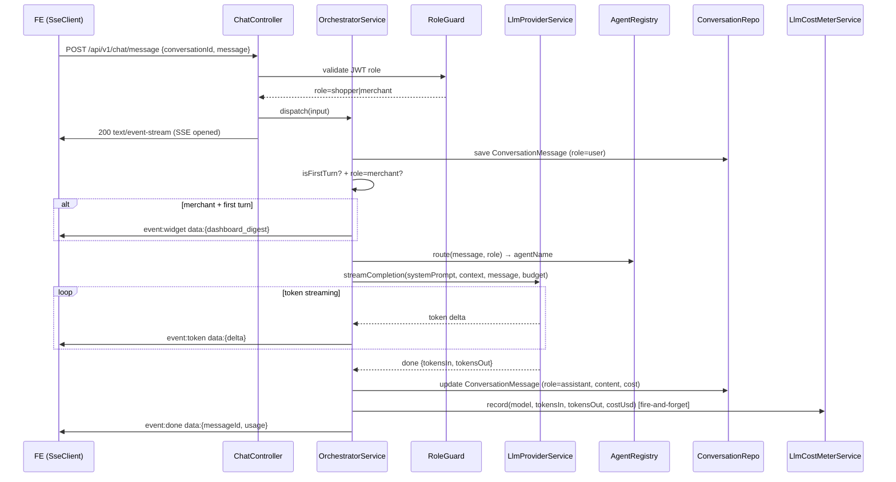
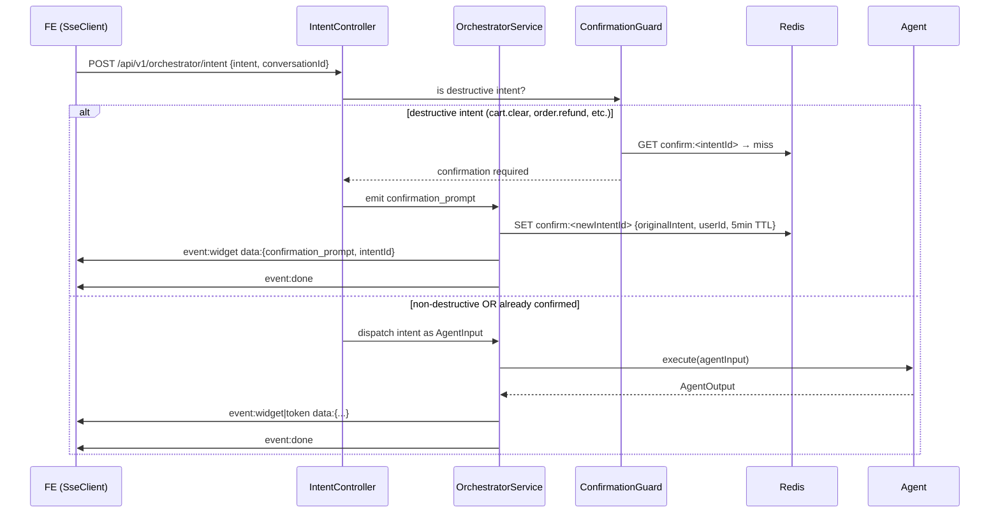
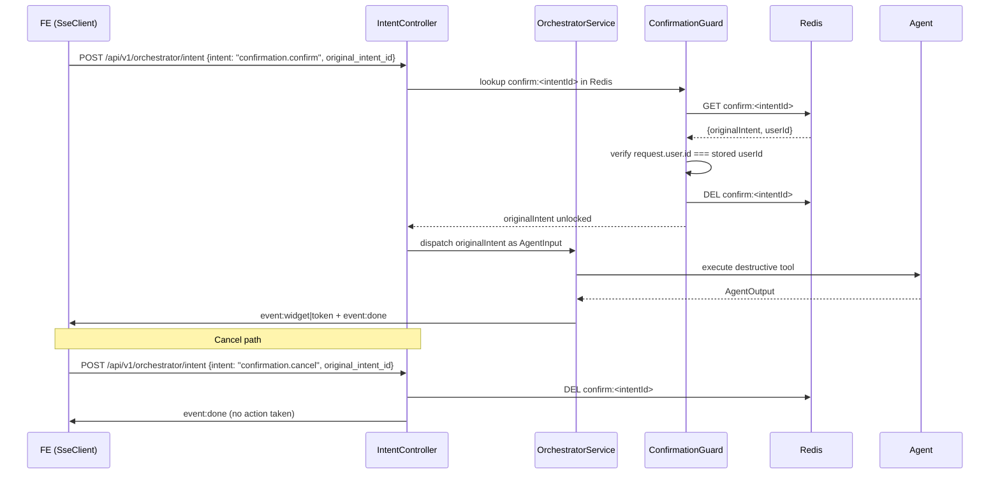

# Business Logic Model — UoW-06 (Orchestrator Core + LLM + SSE Server)

---

## Workflow 1: Text Message → Stream Response



**Text alternative**: FE POSTs message → RoleGuard validates JWT → ChatController opens SSE → Orchestrator saves user turn → optionally emits dashboard_digest for merchant first turn → routes to agent → LLM streams tokens → tokens forwarded to FE → on LLM done, assistant message saved + cost recorded + SSE done event emitted.

---

## Workflow 2: Widget Intent → Route → Respond



**Text alternative**: FE POSTs intent → ConfirmationGuard checks if destructive → if destructive and unconfirmed: orchestrator emits confirmation_prompt widget to SSE + stores intent in Redis → if non-destructive or pre-confirmed: agent dispatched → response streamed.

---

## Workflow 3: Confirmation Confirm/Cancel



**Text alternative**: User confirms → ConfirmationGuard fetches intent from Redis, verifies user matches, deletes key, unlocks original intent → agent executes destructive tool → response streamed. Cancel path deletes Redis key and closes stream without action.

---

## Workflow 4: Multi-Agent Handoff

```mermaid
sequenceDiagram
    participant ORC as OrchestratorService
    participant AGT1 as OrderAgent
    participant AGT2 as CustomerAgent
    participant FE as FE (SseClient)

    ORC->>AGT1: dispatch("refund order #X and tag customer", depth=0)
    AGT1-->>ORC: {type: 'handoff', toAgent: 'customer-agent', reason: 'tag customer after refund', payload: {customerId, tag}}

    ORC->>ORC: depth++ (now 1); check < 3
    ORC->>AGT2: dispatch(handoffPayload, depth=1)
    AGT2-->>ORC: {type: 'widget', widget: {customer_card, tags_updated}}

    ORC->>FE: event:widget data:{customer_card}
    ORC->>ORC: depth check passed; compose final response
    ORC->>FE: event:done
```

**Text alternative**: Orchestrator dispatches to Order Agent → Order Agent returns handoff to Customer Agent with payload → Orchestrator increments depth counter (checks ≤ 3), re-dispatches to Customer Agent → Customer Agent returns widget → Orchestrator streams widget + done.

---

## State Machine: SSE Turn Lifecycle

```
IDLE ──[POST /chat/message or /intent]──► OPEN
  OPEN ──[merchant + first turn]──► EMIT_DIGEST ──► ROUTING
  OPEN ──[not first turn or shopper]──► ROUTING
  ROUTING ──[agent dispatched]──► STREAMING
  STREAMING ──[token received]──► STREAMING (loop)
  STREAMING ──[done received]──► FINALIZING
  STREAMING ──[error thrown]──► ERROR_CLOSE
  FINALIZING ──[cost recorded]──► CLOSED (event:done emitted)
  ERROR_CLOSE ──► CLOSED (event:error emitted)
  CLOSED ──► IDLE
```

**Text alternative**: Turn starts in IDLE, opens on request, optionally emits digest for merchants, routes to agent, streams tokens in a loop, finalizes by recording cost and emitting done event. Any error transitions directly to ERROR_CLOSE which emits an error event and closes.

---

## State Machine: Confirmation Protocol

```
PENDING ──[destructive intent received]──► AWAITING_CONFIRM
  AWAITING_CONFIRM ──[confirmation.confirm + userId match]──► EXECUTING
  AWAITING_CONFIRM ──[confirmation.cancel]──► CANCELLED (Redis DEL)
  AWAITING_CONFIRM ──[TTL=5min expires]──► EXPIRED (Redis auto-DEL)
  EXECUTING ──[agent completes]──► DONE
  EXECUTING ──[agent errors]──► ERROR
  CANCELLED ──► terminal
  EXPIRED ──► terminal
  DONE ──► terminal
  ERROR ──► terminal
```

**Text alternative**: Destructive intent triggers AWAITING_CONFIRM state stored in Redis. Confirm (with matching user) transitions to EXECUTING. Cancel or 5-minute TTL expiry are terminal without execution.
