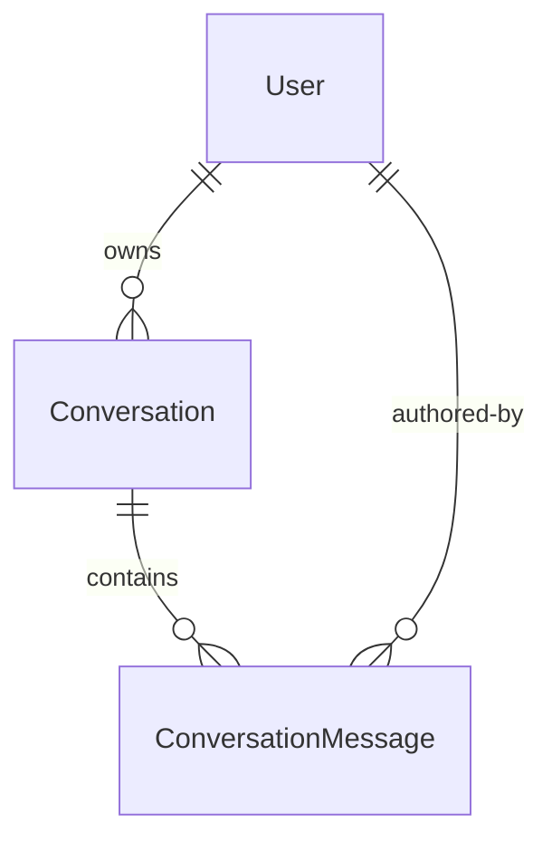

# Domain Entities — UoW-06 (Orchestrator Core + LLM + SSE Server)

---

## Entity: ConversationMessage *(extends UoW-03 AuditLog schema)*

**Purpose**: Persisted record of every user and assistant turn in a chat session.

| Field | Type | Constraints | Notes |
|-------|------|-------------|-------|
| id | UUID | PK | server-generated |
| conversationId | UUID | FK → Conversation.id, NOT NULL | groups turns into a session |
| userId | UUID | FK → User.id, NOT NULL | owner of the turn |
| role | enum(`user`,`assistant`,`system`) | NOT NULL | |
| content | text | NOT NULL | plaintext token accumulation |
| widgetType | varchar(64) | nullable | set when role=assistant and a widget was emitted |
| widgetPayload | jsonb | nullable | full widget JSON; null for text turns |
| tokensIn | int | nullable | LLM input tokens for this turn |
| tokensOut | int | nullable | LLM output tokens for this turn |
| costUsd | numeric(12,6) | nullable | recorded from LlmCostRecord (UoW-04) |
| createdAt | timestamptz | NOT NULL, default now() | |
| traceId | varchar(32) | nullable | OTel trace correlation |

**Relationships**:
- belongs to `Conversation`
- belongs to `User`

**Lifecycle**: Created at start of turn (user role), updated with assistant content as tokens stream, finalized with cost on `done` event.

---

## Entity: Conversation

**Purpose**: Container for a user's chat session — groups all turns.

| Field | Type | Constraints | Notes |
|-------|------|-------------|-------|
| id | UUID | PK | server-generated |
| userId | UUID | FK → User.id, NOT NULL | |
| role | enum(`shopper`,`merchant`,`admin`) | NOT NULL | copied from user at creation time |
| title | varchar(255) | nullable | derived from first user message (truncated 80 chars) |
| openedAt | timestamptz | NOT NULL, default now() | |
| lastActiveAt | timestamptz | NOT NULL, default now() | updated on each new message |
| closedAt | timestamptz | nullable | set when user explicitly ends or retention purge |

**Relationships**:
- belongs to `User`
- has many `ConversationMessage`

**Lifecycle**: Created on first message of a new session; `lastActiveAt` updated on each turn; soft-closed after 6-month retention window.

---

## Entity: PendingConfirmation *(Redis — ephemeral)*

**Purpose**: Holds a destructive intent in Redis waiting for user `confirmation.confirm` or `confirmation.cancel`. TTL = 5 minutes.

| Field | Type | Notes |
|-------|------|-------|
| intentId | string (UUID) | Redis key: `confirm:<intentId>` |
| userId | string (UUID) | owner — must match the confirming user |
| originalIntent | JSON (WidgetIntent) | the destructive intent to resume |
| agentName | string | which agent will execute on confirmation |
| conversationId | string (UUID) | for SSE channel re-join |
| expiresAt | timestamp | Redis TTL; absolute for logging |

**Lifecycle**: Written when orchestrator emits `confirmation_prompt` widget. Deleted on `confirmation.confirm`, `confirmation.cancel`, or TTL expiry.

---

## Entity: PromptTemplate *(File-backed — AI/ML extension)*

**Purpose**: Versioned system-prompt files per agent, tracked as code artifacts. Not a DB table.

| Field | Type | Notes |
|-------|------|-------|
| agentName | string | e.g. `orchestrator`, `product-agent` |
| version | string | semver e.g. `1.0.0` |
| content | string | the full system prompt |
| filePath | string | `api/src/orchestrator/prompts/<agent>.v<version>.txt` |

**Lifecycle**: Deployed with the application; versioned in git. Loaded at module init. Cannot be changed at runtime without a deploy.

---

## Runtime Types (TypeScript — not persisted)

### AgentInput
```typescript
type AgentInput = {
  requestId: string;
  conversationId: string;
  user: { id: string; role: 'shopper' | 'merchant' | 'admin' };
  message: string;
  priorContext?: ContextSlice[];
  intent?: WidgetIntent;
  budget: { maxTokensIn: number; maxTokensOut: number; softDeadlineMs: number };
};
```

### AgentOutput
```typescript
type AgentOutput =
  | { type: 'text'; content: string; tokensIn: number; tokensOut: number; costUsd: number }
  | { type: 'widget'; widget: WidgetPayload; tokensIn: number; tokensOut: number; costUsd: number }
  | { type: 'error'; problem: ProblemDetails }
  | { type: 'handoff'; toAgent: AgentName; reason: string; payload: object };
```

### SseEvent
```typescript
type SseEvent =
  | { event: 'token'; data: { delta: string } }
  | { event: 'widget'; data: WidgetPayload }
  | { event: 'done'; data: { messageId: string; usage: { tokensIn: number; tokensOut: number; costUsd: number } } }
  | { event: 'error'; data: ProblemDetails };
```

---

## ER Diagram



**Text alternative**: User owns zero or more Conversations. Each Conversation contains zero or more ConversationMessages. Each ConversationMessage is authored by a User.

---

## Scope Note

`PendingConfirmation` lives in Redis only — no Postgres migration required for this entity. `ConversationMessage` and `Conversation` require 2 new Postgres migrations (extending UoW-03's schema foundation).
