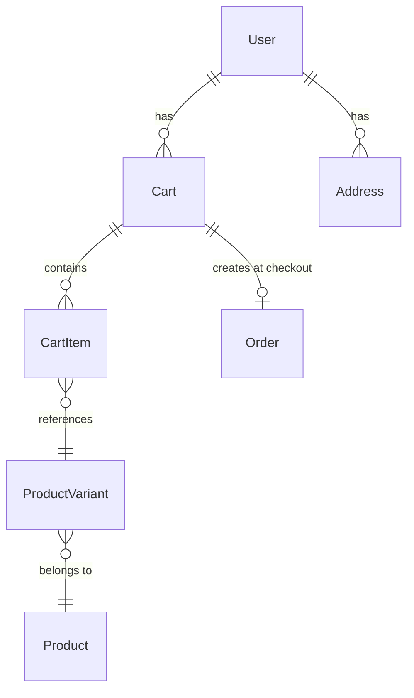

# Domain Entities — UoW-10 (Cart + Checkout)

All entities are **brownfield** — already defined in `api/prisma/schema.prisma`. No new migrations required.

---

## Entity: Cart

**Purpose**: One open cart per shopper, persisted across sessions (SH-06).

| Field | Type | Constraints | Notes |
|-------|------|-------------|-------|
| id | UUID | PK | server-generated |
| userId | UUID | FK → User; partial unique index WHERE status='open' | enforces one-open-cart-per-user |
| status | String | 'open' \| 'checked_out' | default 'open' |
| createdAt | Timestamptz | | |
| updatedAt | Timestamptz | auto-updated | |

**Relationships**:
- belongs to `User`
- has many `CartItem`

**Lifecycle**:
- Created lazily on first `cart_add` if no open cart exists for user
- Transitions `open → checked_out` atomically at checkout (via `$transaction`)
- A new open cart may be created after checkout for the next shopping session

**DB index**: `carts_user_open_idx` — `UNIQUE (user_id) WHERE status = 'open'` (pre-existing)

---

## Entity: CartItem

**Purpose**: Single line item within a cart — one row per variant, quantity tracked.

| Field | Type | Constraints | Notes |
|-------|------|-------------|-------|
| id | UUID | PK | |
| cartId | UUID | FK → Cart | |
| variantId | UUID | FK → ProductVariant | |
| quantity | Int | ≥ 1 | enforced at service layer |
| addedAt | Timestamptz | | |

**Relationships**:
- belongs to `Cart`
- belongs to `ProductVariant`

**Lifecycle**:
- Upsert pattern: if same `variantId` already in `cartId`, increment quantity (merge). No duplicate rows for same variant.
- Deleted when quantity set to 0 (`cart_update_qty(itemId, 0)` → remove)
- All items deleted on `cart_clear` (after confirmation)

**Computed (view layer)**:
- `lineTotalCents = priceCents × quantity`
- `variantLabel` — derived from `variant.attributes` (e.g., "Red / M")

---

## View Model: LineItem (not persisted — constructed at query time)

Returned by `CartService.getEnrichedCart()` and embedded in `cart_summary` widget payload.

| Field | Type | Notes |
|-------|------|-------|
| itemId | UUID | CartItem.id |
| variantId | UUID | |
| productId | UUID | via variant |
| title | String | Product.title |
| variantLabel | String | derived from variant.attributes map |
| priceCents | Int | ProductVariant.priceCents |
| currency | String | ProductVariant.currency |
| quantity | Int | |
| lineTotalCents | Int | priceCents × quantity |
| imageUrl | String? | Product.imageUrl if set |

---

## Entity: Address (reference — not modified)

**Purpose**: Saved shipping address for checkout address lookup.

| Field | Type | Notes |
|-------|------|-------|
| id | UUID | PK |
| userId | UUID | FK → User |
| type | String | 'shipping' \| 'billing' |
| line1 | String | |
| line2 | String? | |
| city | String | |
| state | String | |
| postalCode | String | |
| countryCode | String | e.g., 'IN', 'US' |
| createdAt | Timestamptz | |
| updatedAt | Timestamptz | |

**Lookup**: `findFirst({ userId: actorId, type: 'shipping' }, { orderBy: { createdAt: 'desc' } })` — most-recent shipping address used as default.

---

## ER Diagram

```
User ──< Cart ──< CartItem >── ProductVariant >── Product
User ──< Address
Cart ──[checked_out]──> Order (created at checkout via OrderService)
```


