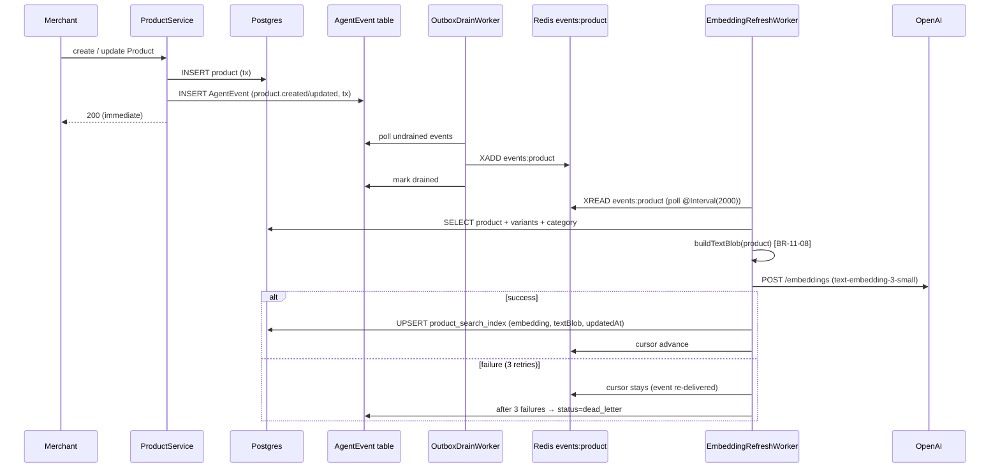
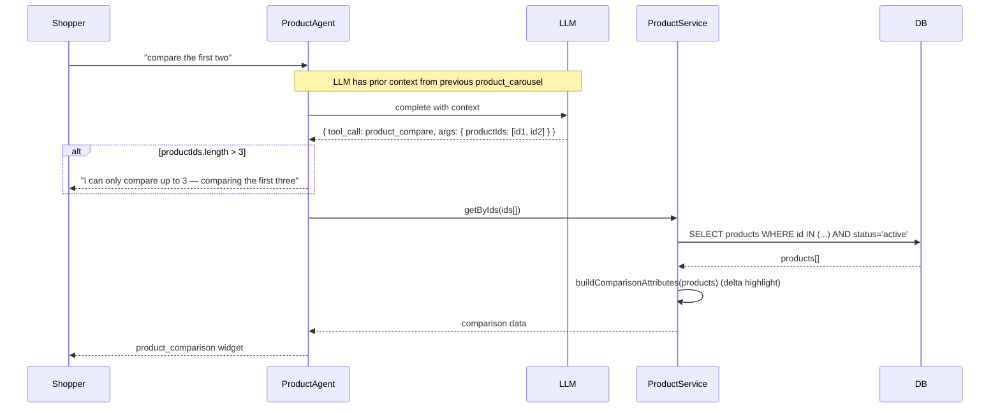
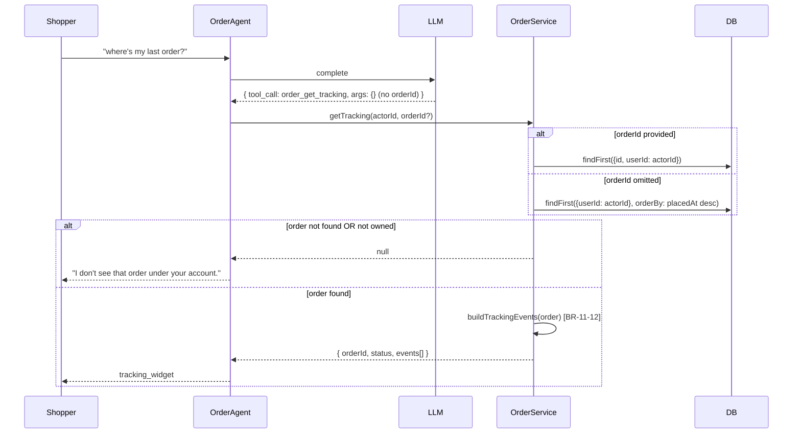
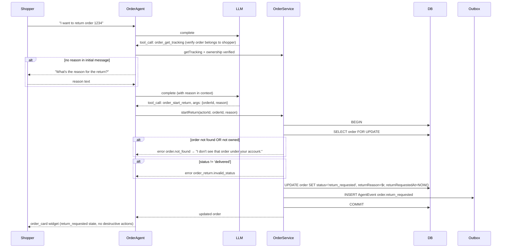
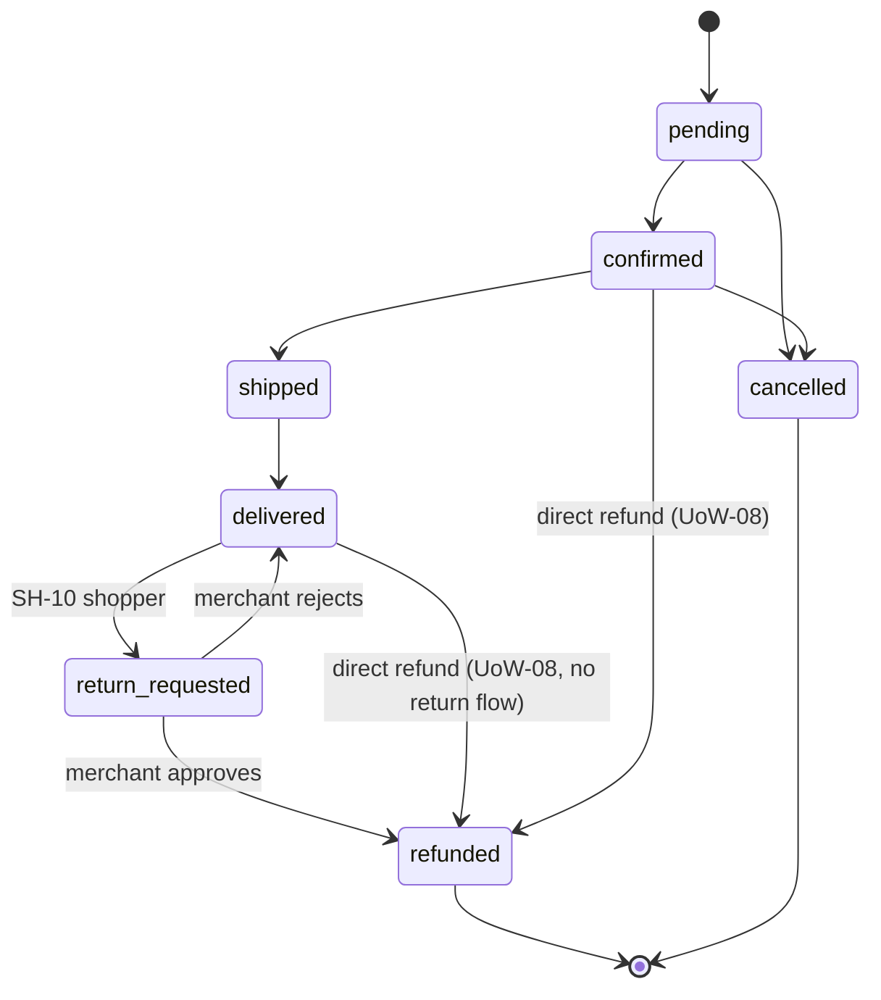

# Business Logic Model — UoW-11

**Generated at**: 2026-05-05T21:38:00Z

This UoW has 5 distinct workflows. Each has a Mermaid sequence + text alternative.

---

## Workflow 1: Embedding Refresh (background)



**Text alternative**: When a merchant creates or updates a product, the ProductService writes both the product row and an outbox AgentEvent in the same transaction. The shared OutboxDrainWorker (UoW-03) drains the event onto a Redis stream `events:product`. A new EmbeddingRefreshWorker polls that stream every 2 seconds. For each event it loads the full product (with variants and category), builds a deterministic text blob, sends it to OpenAI's embedding API, and upserts the result into the `product_search_index` table. On API failure the cursor is not advanced — the event is retried by the next cycle. After 3 failures the AgentEvent row is marked dead_letter (using the existing dead-letter mechanism from UoW-03).

---

## Workflow 2: Semantic Search (SH-02)

```mermaid
sequenceDiagram
    participant Shopper
    participant Orchestrator
    participant Agent as ProductAgent
    participant LLM
    participant SearchSvc as ProductService
    participant OpenAI
    participant DB

    Shopper->>Orchestrator: "show me running shoes under $100"
    Orchestrator->>Agent: route → ProductAgent
    Agent->>LLM: complete(prompt, message, tools)
    LLM-->>Agent: { tool_call: product_search, args: { query, maxPrice } }
    Agent->>SearchSvc: search(query, filters)
    SearchSvc->>OpenAI: POST /embeddings (query)
    alt embed OK
        SearchSvc->>DB: kNN: ORDER BY embedding <=> $q LIMIT 8 WHERE active AND price <= max
        DB-->>SearchSvc: ranked products
    else embed fails
        SearchSvc->>DB: keyword fallback: ts_rank(tsv @@ plainto_tsquery)
        DB-->>SearchSvc: ranked products + usedFallback=true
    end
    SearchSvc-->>Agent: { products[], usedFallback }
    alt usedFallback
        Agent-->>Shopper: "I couldn't do semantic search; here are keyword matches:" + product_carousel
    else
        Agent-->>Shopper: product_carousel widget
    end
```

**Text alternative**: A shopper sends a natural-language search query. The orchestrator routes to ProductAgent. The agent invokes the `product_search` tool. ProductService first tries to embed the query via OpenAI and run a cosine-distance kNN query on `product_search_index`, joined back to active products with optional price/category filters. If embedding fails (timeout, error, vector index missing), the service falls back to a Postgres tsvector keyword search and tags the response with `usedFallback: true`. The agent surfaces a fallback notice to the shopper per SH-02 acceptance, then returns a `product_carousel` widget capped at 8 items.

---

## Workflow 3: Product Compare (SH-03)



**Text alternative**: Shopper requests a comparison of products from a previous carousel. The LLM resolves which products to compare via conversation context and calls `product_compare` with up to 3 product IDs. If more than 3 are requested the agent caps at 3 and surfaces an explanation. ProductService loads the products, builds a comparison row (common + differing attributes), and returns a `product_comparison` widget.

---

## Workflow 4: Order Tracking (SH-09)



**Text alternative**: Shopper asks about an order. OrderAgent invokes `order_get_tracking`. If `orderId` is supplied, OrderService fetches the order with both id AND userId in the WHERE clause (anti-enumeration). If `orderId` is missing, the most-recent order (by placedAt DESC) for the shopper is loaded. A null result yields a uniform "I don't see that order under your account" message regardless of whether it was missing or owned by another user. On success, `buildTrackingEvents` synthesizes the timeline from order timestamps and the agent emits a `tracking_widget`.

---

## Workflow 5: Return Initiation (SH-10)



**Text alternative**: Shopper asks to return an order. OrderAgent first verifies the order belongs to the shopper via `order_get_tracking` (ownership guard). If the shopper hasn't supplied a reason in the initial message, the agent asks one clarifying question before proceeding. With orderId + reason in hand, the agent invokes `order_start_return`. OrderService loads the order with a row lock, validates current status is `delivered`, updates the row to `return_requested` plus the new reason and timestamp fields, and emits a `order.return_requested` outbox event in the same transaction. The agent then renders an `order_card` reflecting the new state with cancel/refund buttons hidden.

---

## State Diagram — Order Status (extended)



**Text alternative**: The new `return_requested` state sits between `delivered` and `refunded`. Only a delivered order can transition to return_requested (shopper-initiated). From return_requested the merchant can either approve (→ refunded) or reject (→ delivered). The pre-existing direct-refund paths from UoW-08 remain unchanged for refunds that don't go through a return flow.
