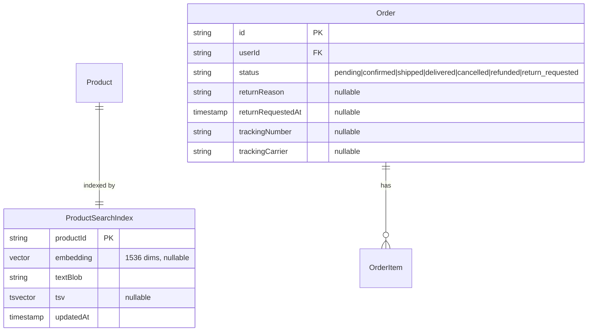

# Domain Entities — UoW-11 (Semantic Search + Tracking + Returns)

**Generated at**: 2026-05-05T21:35:00Z
**Brownfield**: Most entities exist from UoW-03; this document records ONLY the changes/additions.

---

## Entity Changes

### Entity: Order — MODIFIED

Two new fields for the returns flow (SH-10):

| Field | Type | Constraints | Notes |
|-------|------|-------------|-------|
| `returnReason` | TEXT | nullable | Free-text reason captured by OrderAgent before status transition |
| `returnRequestedAt` | TIMESTAMPTZ | nullable | Set when status transitions to `return_requested` |

**Status enum extended**: `pending`, `confirmed`, `shipped`, `delivered`, `cancelled`, `refunded`, **`return_requested`** (new).

**New transitions in `VALID_ORDER_TRANSITIONS`**:
- `delivered → return_requested` (shopper-initiated via `order_start_return`)
- `return_requested → refunded` (merchant approves via existing `order_refund`)
- `return_requested → delivered` (merchant rejects return — reverts to delivered)

**Indexes**: no new index needed (queries by `userId` already covered by `orders_user_placed_at_idx`).

---

### Entity: ProductSearchIndex — UTILIZED (no schema change)

The table already exists from UoW-03. UoW-11 is the first UoW to actually populate and query it.

| Field | Type | Constraints | Notes |
|-------|------|-------------|-------|
| `productId` | UUID | PK, FK → Product | One-to-one with Product |
| `embedding` | vector(1536) | nullable | OpenAI text-embedding-3-small output |
| `textBlob` | TEXT | not null | Concatenated source text used for embedding (title + description + category + active variant attributes) |
| `tsv` | tsvector | nullable | DB-generated full-text-search index from textBlob |
| `updatedAt` | TIMESTAMPTZ | not null | Last refresh timestamp |

**New index (this UoW)**:
- `ivfflat` on `embedding` using `vector_cosine_ops` with `lists = 100` (tuned for ≤10k products)
- GIN index on `tsv` for keyword fallback (may already exist; verified during migration)

**Lifecycle**:
- Row created/updated by `EmbeddingRefreshWorker` (consumes `product.created` / `product.updated` outbox events)
- Row never deleted (orphan rows acceptable; cleaned during maintenance reindex)

---

### Entity: AgentEvent — UTILIZED (no schema change)

UoW-11 adds new event types to the existing AgentEvent outbox table:

| eventType | Emitted by | Payload shape | Consumer |
|-----------|------------|---------------|----------|
| `product.created` | ProductService.create | `{ productId }` | EmbeddingRefreshWorker |
| `product.updated` | ProductService.update | `{ productId }` | EmbeddingRefreshWorker |
| `order.return_requested` | OrderService.startReturn | `{ orderId, userId, reason }` | (future analytics; no MVP consumer) |

These reuse the existing `AgentEvent` table + `OutboxDrainWorker` from UoW-03 — no new tables.

---

## ER Diagram (delta only)



**Text alternative**: `Product` has a one-to-one relationship with `ProductSearchIndex` via the productId. `Order` gains two new nullable fields (returnReason, returnRequestedAt) and a new status value (return_requested). Tracking-related fields (trackingNumber, trackingCarrier) already exist from UoW-03.

---

## Migration: `add_order_return_fields`

```sql
-- Migration: add_order_return_fields
ALTER TABLE app.orders
  ADD COLUMN return_reason TEXT,
  ADD COLUMN return_requested_at TIMESTAMPTZ;

-- No data backfill needed; both columns nullable
-- No index on these — queries access them via primary key (orderId) only
```

## Migration: `enable_product_search_indexes`

```sql
-- Migration: enable_product_search_indexes
CREATE INDEX IF NOT EXISTS product_search_index_embedding_ivfflat
  ON app.product_search_index USING ivfflat (embedding vector_cosine_ops)
  WITH (lists = 100);

CREATE INDEX IF NOT EXISTS product_search_index_tsv_gin
  ON app.product_search_index USING gin (tsv);
```

(The pgvector extension is already enabled at the datasource level in `schema.prisma` — no `CREATE EXTENSION` needed.)

---

## Out of scope (recorded for posterity)

- Live carrier API integration (B&L, BlueDart, Aramex) — `tracking_widget.events[]` is synthesized from order lifecycle, per Q7
- Per-item return selection (return only some items in a multi-item order) — initial MVP is whole-order return; SH-10 acceptance criterion notes "item-level selection if applicable" but is satisfied by whole-order in v1
- Embedding versioning / migrations between embedding models — single model in MVP; tracked via `updatedAt`
- Return refund automation — merchant must still call `order_refund` after approving the return
