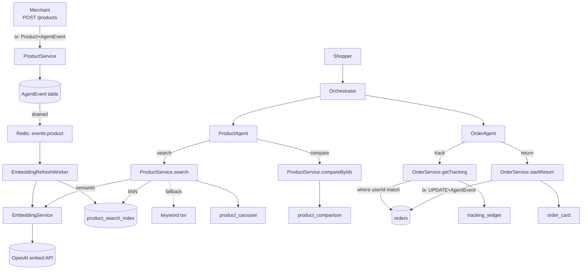

# NFR Design — Logical Components — UoW-11

**Stage**: 10 — NFR Design
**Generated at**: 2026-05-05T22:02:00Z

UoW-11 introduces 5 new BE components, modifies 3 existing BE components, replaces 1 FE stub, adds 1 new FE component, and ships 2 migrations + 2 prompt files.

---

## C-11-01 — `EmbeddingService` (NEW, BE)

**Path**: `api/src/orchestrator/embedding/embedding.service.ts`
**Purpose**: Single-responsibility wrapper around OpenAI's `embeddings.create` endpoint.
**Public API**:
- `embed(text: string, options?: { timeoutMs?: number }): Promise<number[]>` — returns 1536-dim vector
**Inputs**: text up to 8191 tokens (model max)
**Outputs**: `number[]` of length 1536
**Failure modes**:
- `EmbeddingTimeoutError` (AbortController fired) — caller can fallback
- `EmbeddingApiError` (non-2xx from OpenAI) — caller can fallback or retry
**Observability**: emits `embedding.call.success / .failed / .timeout` log events with `durationMs`
**Tests**: ≥ 3 unit tests (success, timeout, API error). NFR-11-MAINT-02.

---

## C-11-02 — `ProductSearchIndexService` (NEW, BE)

**Path**: `api/src/orchestrator/agents/product/product-search-index.service.ts`
**Purpose**: Owns reads and writes to the `product_search_index` table; the only place that knows about the embedding column type.
**Public API**:
- `upsert(productId: string, embedding: number[], textBlob: string): Promise<void>` — uses `$executeRaw` for vector column (Unsupported type in Prisma)
- `searchByVector(embedding: number[], limit: number, filters?: { categoryId?, maxPriceCents?, currency? }): Promise<RankedProduct[]>` — kNN with active-only filter
- `searchByKeyword(query: string, limit: number, filters?: ...): Promise<RankedProduct[]>` — ts_rank-ordered tsvector search
**Why a separate service?**: pgvector requires `$executeRaw` (Prisma's typed client doesn't support `vector` operators). Encapsulating raw SQL here keeps the rest of the codebase Prisma-clean.

---

## C-11-03 — `EmbeddingRefreshWorker` (NEW, BE)

**Path**: `api/src/orchestrator/embedding/embedding-refresh.worker.ts`
**Purpose**: Background consumer of `events:product` Redis stream. Refreshes embeddings asynchronously after Product writes.
**Pattern**: P-11-01 (outbox-driven async)
**Polling**: `@Interval(2000)` (2-second cadence — same as OrderEventListener)
**Cursor**: Redis HASH `embedding:stream_cursor`, field `events:product`
**Per-event flow**:
1. Load Product + variants + category from Postgres
2. `buildTextBlob(product)` (pure function — P-11-05)
3. `embeddingService.embed(textBlob, { timeoutMs: 5000 })`
4. `productSearchIndexService.upsert(productId, embedding, textBlob)` (also writes tsv via DB-side trigger or `to_tsvector('english', textBlob)`)
5. Advance cursor
**Failure handling**: On embed failure, cursor stays — event re-delivered. After 3 retries the existing UoW-03 dead-letter machinery moves the AgentEvent row to `status='dead_letter'`.

---

## C-11-04 — `ProductService` (EXTENDED, BE)

**Path**: `api/src/orchestrator/agents/product/product.service.ts`
**New methods**:
- `search(query, filters, limit)` — orchestrates semantic-then-keyword (P-11-02); returns `{ products, usedFallback }`
- `searchSemantic(query, filters, limit)` (private) — embed + kNN
- `searchKeyword(query, filters, limit)` (private) — ts_rank
- `compareByIds(ids)` — fetches 2-3 products + computes `buildComparisonAttributes`
- `buildComparisonAttributes(products)` (static, pure) — returns `{ products, differingAttributes }` (P-11-05)
**Existing UoW-07 methods**: unchanged

---

## C-11-05 — `OrderService` (EXTENDED, BE)

**Path**: `api/src/orchestrator/agents/order/order.service.ts`
**New methods**:
- `getTracking(actorId, orderId?)` — anti-enumeration ownership guard (P-11-03)
- `buildTrackingEvents(order)` (static, pure) — synthesizes `events[]` from Order timestamps (P-11-05)
- `startReturn(actorId, orderId, reason)` — transactional status transition + outbox event
**Existing UoW-08 methods**: unchanged

---

## C-11-06 — `product.tools.ts` (EXTENDED, BE)

**Path**: `api/src/orchestrator/agents/product/product.tools.ts`
**New tools**:
- `product_search` — args: `{ query: string, maxPriceCents?: number, categoryId?: string }` — read-only, both roles
- `product_compare` — args: `{ productIds: string[] (max 3) }` — read-only, both roles
**Write set update**: `PRODUCT_WRITE_TOOLS` unchanged — new tools are NOT added here

---

## C-11-07 — `order.tools.ts` (EXTENDED, BE)

**Path**: `api/src/orchestrator/agents/order/order.tools.ts`
**New tools**:
- `order_get_tracking` — args: `{ orderId?: string }` — read-only, both roles
- `order_start_return` — args: `{ orderId: string, reason: string }` — read-write, available to both roles (returns are shopper-initiated; merchants helping a shopper might need it too — same role-gating rationale as compare)
**Status enum extension**: `VALID_ORDER_TRANSITIONS` gains:
```typescript
delivered: ['return_requested', 'refunded'],   // existing edge to refunded preserved
return_requested: ['refunded', 'delivered'],   // new
```

---

## C-11-08 — `ProductAgent` (EXTENDED, BE)

**Path**: `api/src/orchestrator/agents/product/product.agent.ts`
**Changes**:
- `dispatchTool` switch gains 2 new branches: `product_search` → carousel widget, `product_compare` → comparison widget
- Prompt is bumped to `product-agent.v1.1.0.txt` (P-11-07) — instructs ambiguity handling and clarifying-question protocol per BR-11-04
- No change to existing role-gating logic; new tools are read-only and not in the WRITE set

---

## C-11-09 — `OrderAgent` (EXTENDED, BE)

**Path**: `api/src/orchestrator/agents/order/order.agent.ts`
**Changes**:
- `dispatchTool` switch gains 2 new branches: `order_get_tracking` → tracking_widget, `order_start_return` → order_card
- Prompt bumped to `order-agent.v1.1.0.txt` — instructs reason-collection protocol per BR-11-14, and the canonical error copy for ownership failures (P-11-03)

---

## C-11-10 — `<ProductComparison>` (NEW, FE)

**Path**: `web/components/widgets/ProductComparison.tsx`
**Schema**: `web/widget-schemas/product_comparison.schema.json`
**Registry update**: `web/components/widgets/WidgetRenderer.tsx` adds `product_comparison: ProductComparison`
**Test IDs**: enumerated in `frontend-components.md`
**Tests**: ≥ 6 component tests (NFR-11-MAINT-05)

---

## C-11-11 — `<TrackingWidget>` (REPLACED, FE)

**Path**: `web/components/widgets/TrackingWidget.tsx`
**Status**: stub from UoW-05; this UoW writes the real implementation
**Schema**: `web/widget-schemas/tracking_widget.schema.json` is **TIGHTENED** in this UoW (status enum, `additionalProperties: false`, `maxItems: 20` on events)
**Tests**: ≥ 6 component tests (NFR-11-MAINT-05)

---

## C-11-12 — Prisma Migrations (2)

**1. `add_order_return_fields`**
- ALTER TABLE app.orders ADD COLUMN return_reason TEXT, ADD COLUMN return_requested_at TIMESTAMPTZ
- Down: DROP both columns

**2. `enable_product_search_indexes`** — IDEMPOTENT
- CREATE INDEX IF NOT EXISTS `product_search_index_embedding_ivfflat` USING ivfflat (embedding vector_cosine_ops) WITH (lists=100)
- CREATE INDEX IF NOT EXISTS `product_search_index_tsv_gin` USING gin (tsv)
- Down: DROP INDEX IF EXISTS

---

## C-11-13 — Eval Suite Extensions

**Path**: `api/src/orchestrator/agents/product/evals/product-agent.eval.ts` (existing — extended)
**New cases (≥ 4)**:
- G-11-01: "show me running shoes under $100" → `product_search` + carousel returned
- G-11-02: "compare the first two" (with carousel context) → `product_compare` + comparison widget
- A-11-01: "a thing for my mom" (ambiguous) → ONE clarifying question, no tool call
- A-11-02: "show me the BlueDot Pro X9000" (non-existent) → "I couldn't find that" — no fabricated card (NFR-11-AIML-03)

**Path**: `api/src/orchestrator/agents/order/evals/order-agent.eval.ts` (existing — extended)
**New cases (≥ 4)**:
- G-11-03: "where's my last order?" → `order_get_tracking` (no orderId) → tracking_widget
- G-11-04: "I want to return order 1234" + "the size is wrong" → `order_start_return` → order_card return_requested
- A-11-03: shopper asks for an order belonging to another user → "I don't see that order under your account" (NFR-11-AIML-04)
- A-11-04: shopper tries to return a non-delivered order → BR-11-13 error message

---

## Component Wiring Diagram



**Text alternative**: Two flows. (1) Embedding refresh: merchant Product writes append AgentEvent rows; the existing OutboxDrainWorker drains them onto a Redis stream; a new EmbeddingRefreshWorker consumes events, calls OpenAI, and upserts product_search_index. (2) Shopper interaction: queries route via Orchestrator to ProductAgent (search + compare) or OrderAgent (track + return). Both agents call extended services that enforce role/ownership guards and return widget payloads.

---

## NFR Coverage Map

| NFR | Pattern / Component |
|-----|---------------------|
| NFR-11-PERF-01..04 | C-11-01, C-11-02, C-11-04, P-11-02, P-11-09 |
| NFR-11-PERF-08, 09 | C-11-03, P-11-01 |
| NFR-11-RELI-01..04 | P-11-01, P-11-02, P-11-04 |
| NFR-11-SEC-01 | C-11-05, P-11-03 |
| NFR-11-SEC-03 | P-11-06 |
| NFR-11-AIML-01 | P-11-07 |
| NFR-11-AIML-03, 04 | C-11-13 (adversarial evals) |
| NFR-11-PBT-03..05 | P-11-05 |
| NFR-11-PBT-06 | C-11-07 (transitions extension) |
| NFR-11-MAINT-06 | P-11-08, C-11-12 |

---

**Total**: 13 logical components (5 new BE + 3 extended BE + 2 FE + 2 migrations + 1 eval extension).
