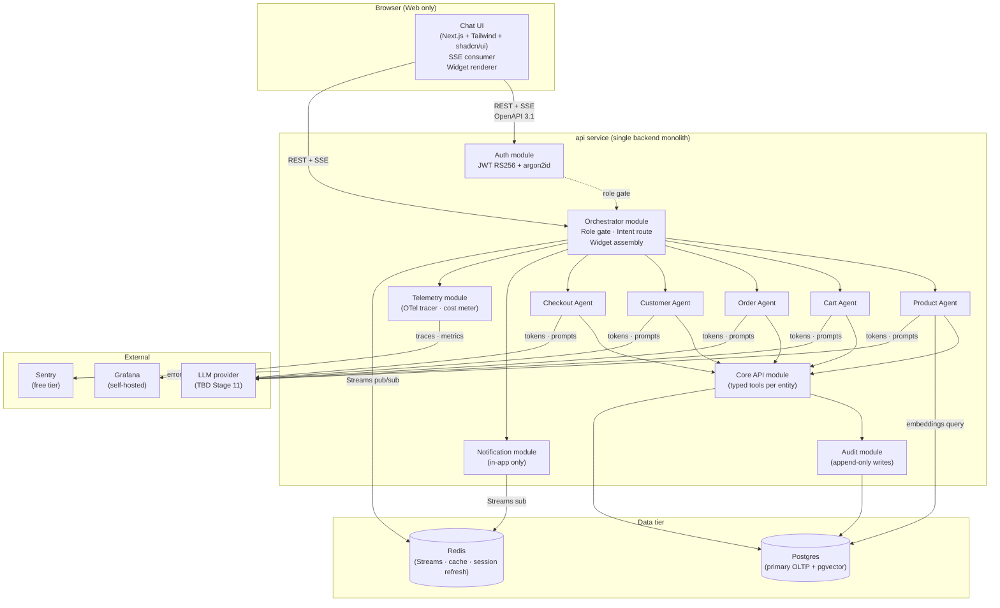

# Application Design — Chat-Native E-Commerce Platform

**Tier**: Greenfield (Comprehensive)
**Architectural style**: Modular Monolith
**Generated at**: 2026-05-04T00:20:00Z

This is the top-level architecture synthesis. Reads alongside `components.md`, `data-model.md`, `agent-contracts.md`, `event-topology.md`, and the ADRs in `adr/`.

---

## 1. Architecture Overview



> **Diagram conventions**: solid arrows = synchronous calls; dashed arrows = control / policy; subgraphs = process boundaries. The whole `api` subgraph is **one binary, one container** — modules are code packages, not services.

---

## 2. Cross-Stack Contracts

| Dimension | Decision |
|-----------|----------|
| **API surface** | REST (OpenAPI 3.1) for CRUD + structured-intent endpoints; SSE for chat streaming |
| **Schema source-of-truth** | `shared/openapi.yaml` in the monorepo; FE generates a typed client at build time; BE generates handlers / types from same spec |
| **Versioning policy** | URL-versioned `/api/v1/...`; breaking changes go to `/api/v2/...`; v1 retained until v2 reaches feature-parity |
| **Error envelope** | RFC 7807 `application/problem+json` with extensions: `request_id`, `trace_id`, `error_code`, `correlation_id` |
| **Pagination** | Cursor-based (`?cursor=<opaque>&limit=<n>`); `next` cursor returned in response body |
| **Idempotency** | All POST/PATCH/DELETE accept `Idempotency-Key` header; agents always include one |
| **Streaming format** | SSE with named events: `token`, `widget`, `done`, `error` |

---

## 3. Auth & Identity

| Aspect | Value |
|--------|-------|
| Method | Email + password (argon2id, memory=64 MB, parallelism=4, iterations=3) |
| Session token | JWT signed RS256, 15-minute access TTL, refresh-token rotation on use |
| Refresh-token store | Redis (key=`rt:<jti>`, sliding 30-day TTL); JTI rotation on every refresh |
| Role | One of `shopper` / `merchant` / `admin`; enforced at orchestrator routing time |
| Public signup | NO — internal/demo MVP. Pilot users seeded by admin (FR-AUTH-05) |
| Rate limiting | 5 wrong-password attempts in 1 min → 15-min cooldown; Redis-backed counter |

---

## 4. Data Stores

| Store | Purpose | Notes |
|-------|---------|-------|
| Postgres 15+ | Primary OLTP for all 14 entities (see `data-model.md`) | Schema: `app` (entities) + `audit` (audit_log only, write-only role) |
| Postgres `pgvector` extension | Embedding store for semantic product search | One vector column on `product_search_index` table; ivfflat index |
| Redis 7+ | (1) Refresh-token store, (2) Streams event bus, (3) Rate-limit counters, (4) Hot cache for `dashboard_digest` aggregations | Single-node MVP; persistence = AOF every 1 s |
| (No separate vector / queue / search service) | — | Lean by design |

---

## 5. Notable Patterns

| Pattern | Where | Why |
|---------|-------|-----|
| **Modular monolith** | `api` service top-level | Lean budget; team-of-2; ≤ 10 internal users |
| **Dependency injection** | NestJS-style providers (Stage 11 confirms) | Easy mocking for agent tests + eval suites |
| **Hexagonal / ports & adapters** | Core API exposes typed "tools" (the agent-callable surface) as ports; Postgres adapter is the only initial implementation | Lets agents be tested without a live DB |
| **Event sourcing — partial** | Domain events written to `agent_events` table on every domain mutation; Redis Streams is the **transport**; Postgres is the **system of record** | PRD § 10 + outbox pattern |
| **Outbox pattern** | Domain mutation + event row are committed in the same DB tx; a worker drains the outbox into Redis Streams | Guarantees at-least-once event delivery without distributed transactions |
| **Idempotency keys** | All write endpoints | Required for agent retries (NFR-RELI-01) |
| **Role gate** | Orchestrator decorator that runs *before* any agent dispatch | NFR-SEC-06; cross-role abuse blocked at one layer |
| **Confirmation-prompt-before-destructive** | Orchestrator middleware over destructive intents (cart-clear, order-cancel, customer-delete, refund) | FR-ORCH-04 |

---

## 6. Architecture Decision Records

ADRs live in `aidlc-docs/inception/application-design/adr/`. The 6 captured for this MVP:

| ADR | Title |
|-----|-------|
| [ADR-001](adr/ADR-001-modular-monolith.md) | Adopt modular monolith over microservices |
| [ADR-002](adr/ADR-002-pgvector-over-pinecone.md) | Use pgvector instead of a managed vector DB |
| [ADR-003](adr/ADR-003-in-process-agents.md) | Keep agents in-process within the api service |
| [ADR-004](adr/ADR-004-redis-streams-event-bus.md) | Redis Streams as the inter-agent event bus |
| [ADR-005](adr/ADR-005-rest-plus-sse.md) | REST + SSE rather than GraphQL or WebSockets |
| [ADR-006](adr/ADR-006-monorepo-layout.md) | Monorepo with web / api / shared / infra |

---

## 7. Repository layout (monorepo)

```
ECommmer-AIDLC/
├── web/                       # Next.js (App Router) chat UI
│   ├── app/
│   │   └── chat/page.tsx
│   ├── components/widgets/    # all 12 widget renderers
│   ├── lib/sse-client.ts
│   └── package.json
├── api/                       # NestJS modular monolith
│   ├── src/
│   │   ├── auth/              # Auth module
│   │   ├── orchestrator/      # Orchestrator + role gate
│   │   ├── agents/
│   │   │   ├── product/
│   │   │   ├── cart/
│   │   │   ├── order/
│   │   │   ├── customer/
│   │   │   └── checkout/
│   │   ├── core-api/          # Typed tools per entity (port layer)
│   │   ├── persistence/       # Prisma client + repository adapters
│   │   ├── audit/
│   │   ├── notifications/
│   │   ├── telemetry/         # OTel tracer + cost meter
│   │   └── main.ts
│   ├── prisma/schema.prisma
│   └── package.json
├── shared/
│   ├── openapi.yaml           # source of truth for the REST contract
│   ├── widget-schemas/        # JSON schemas for all 12 widgets
│   └── intents/               # widget interaction intent schemas
├── infra/                     # Stage 11 / Stage 16 decide the contents
├── scripts/
│   ├── ci.sh                  # codiste convention
│   ├── dev.sh
│   └── seed-pilot-users.ts
└── aidlc-docs/                # this folder
```

---

## 8. Cross-stack shared concerns

| Concern | Decision |
|---------|----------|
| Logging | Structured JSON via `pino` (BE) and console-JSON shim (FE); 10 required fields per codiste preset |
| Tracing | OTel SDK in BE; trace ID propagated to FE via `traceparent` header; rendered into Sentry events |
| Cost telemetry | Per-agent counter `llm_tokens_total{agent, model, role}` + histogram `llm_cost_usd_bucket`; exported to Grafana |
| i18n | Architectural placeholder only (en-IN single-locale MVP); all user-facing strings funnel through `t()` for future swap |
| Time zone | Server canonical = UTC; UI renders in `Asia/Kolkata` |
| Feature flags | Lightweight env-var-driven flags for MVP (no third-party SDK); structured for upgrade if needed |
| Secrets | `.env` for local; cloud-target's secret manager (Stage 11 / 16); never logged; never in code |

---

## 9. Out-of-scope for this design

- Multi-tenant data partitioning (single-tenant MVP)
- Multi-region deploy
- Live payment gateway integration (simulated only)
- Native mobile clients
- Email / SMS notification delivery
- Multi-language / multi-locale
- Voice interface
- Public signup
- Multi-modal (image upload) input
