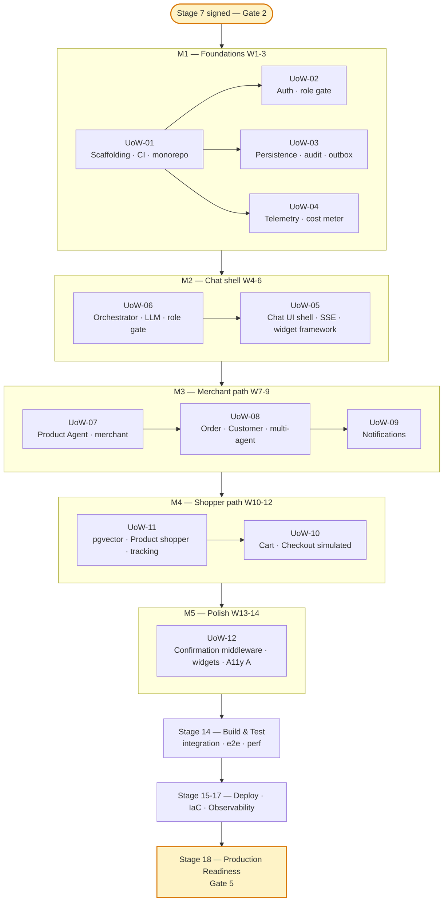
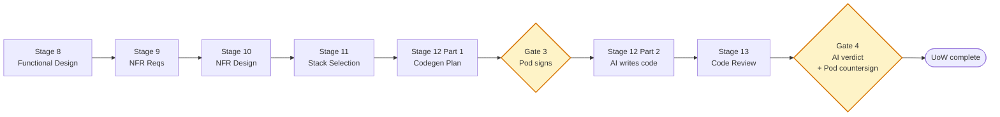

# Execution Plan

**Tier**: Greenfield (Comprehensive)
**Generated at**: 2026-05-04T00:23:00Z
**Stacks affected**: Frontend (Next.js), Backend (NestJS modular monolith), DB (Postgres + pgvector), Cache/Stream (Redis)

This is the canonical decomposition for the MVP. It (a) breaks the work into 12 sequenced **Units of Work (UoWs)**, (b) commits per-stage execute / skip decisions for each downstream stage, and (c) carries the Mermaid visualization the pod will sign.

---

## 1. Scope

- **Stacks affected**: Frontend (Web), Backend (Node), DB (Postgres), Redis. No Mobile, no Backend-Python, no Backend-Go.
- **Files affected**: greenfield — every file is new
- **Stories included**: all 26 from `user-stories.md` (10 Shopper + 13 Merchant + 3 Cross-Cutting)

## 2. Change Impact

- **User-facing changes**: yes — entire chat UI is new
- **API contract changes**: yes — new `shared/openapi.yaml` is the source of truth
- **Schema changes**: yes — full 15-table Postgres schema (greenfield)
- **NFR changes**: full set established at Stage 4 — performance, security, AI/ML, PBT (partial), accessibility (Level A)
- **Breaking changes**: N/A (greenfield)

## 3. Risk Assessment

**Risk level**: Medium-High

**Top three risks (carried from BR § 6 + sharpened here)**:

| # | Risk | Mitigation |
|---|------|-----------|
| 1 | LLM operating cost dominates the < $25K budget | Cost telemetry from day one (UoW-04). Per-agent token-budget caps (agent-contracts.md § 7). Budget alarm threshold reviewed weekly. |
| 2 | Chat-native discovery UX is unproven; shoppers may abandon if slower than a grid | Internal pilot scope reduces real-world exposure. Stage 14 Build & Test runs end-to-end discover→cart→checkout flow on synthetic data; pilot starts with 5–10 friendly users. |
| 3 | Multi-agent coordination (e.g., refund + tag in one turn) introduces partial-failure modes | Outbox pattern + at-least-once delivery (event-topology.md). Orchestrator surfaces partial states honestly (EC-04). Eval suite for multi-agent turns at Gate #4. |

## 4. Multi-Module Coordination (FE↔BE)

- **Stack hand-offs**:
  - `shared/openapi.yaml` change → regenerate FE typed client → update BE handlers — single PR, single CI run
  - DB migration → BE deploy → FE deploy (in that order) for any breaking schema change
- **Sequencing constraint**: web/ never deploys ahead of api/ for the same contract version
- **Cross-stack contract update plan**: every PR that touches `shared/openapi.yaml` must also include the regenerated FE client AND updated BE handlers AND a one-line CHANGELOG entry; CI fails if any of the three is missing

---

## 5. Unit Execution Order

Twelve UoWs sequenced by dependency, milestone, and risk-front-loading principles (schema-first, BE-before-FE, foundations-before-features).

| # | UoW | Milestone | Stack | Stories satisfied | Why this position |
|---|-----|-----------|-------|-------------------|-------------------|
| **UoW-01** | Project scaffolding + monorepo + CI + dev scripts | M1 | Repo | (foundation — none directly) | Everything else depends on this |
| **UoW-02** | Auth + role gate (NestJS module + login/refresh API + FE login form) | M1 | BE+FE | SH-01, MR-01 (auth parts) | Every story below requires authenticated requests |
| **UoW-03** | Persistence + audit log + idempotency + outbox foundation | M1 | BE+DB | CC-03 | Schema must exist before any agent can read/write |
| **UoW-04** | Telemetry: OTel tracer + LLM cost meter + structured logging | M1 | BE+OBS | CC-02 | Lean budget makes cost-from-day-one non-negotiable |
| **UoW-05** | Chat UI shell + SSE client + widget renderer framework | M2 | FE | SH-01/MR-01 (chat surface parts) | The "container" everything else renders into |
| **UoW-06** | Orchestrator core + role gate + LLM integration + SSE server | M2 | BE | (foundation for every agent) | Agents plug into this |
| **UoW-07** | Product Agent + Product tools (merchant mode first) | M3 | BE+FE+AGT | MR-02, MR-03, MR-04 | Highest-value merchant flow; tests the agent harness end-to-end |
| **UoW-08** | Order + Customer agents + multi-agent coordination (refund+tag) | M3 | BE+FE+AGT | MR-05, MR-06, MR-07, MR-08, MR-09, MR-12, MR-13 | Multi-agent stress-tests the orchestrator |
| **UoW-09** | Notifications subsystem (events + low-stock watcher + inbox) | M3 | BE+FE | MR-10, MR-11 | Closes out the merchant path |
| **UoW-10** | Cart + Checkout agents (simulated payment) | M4 | BE+FE+AGT | SH-04, SH-05, SH-06, SH-08 | Shopper conversion flow, depends on Product Agent shopper mode (next UoW) |
| **UoW-11** | Semantic search (pgvector + Product Agent shopper mode) + tracking + returns | M4 | BE+FE+VEC+AGT | SH-02, SH-03, SH-09, SH-10 | The most LLM/RAG-heavy UoW; isolated for focused eval |
| **UoW-12** | Confirmation middleware + remaining widgets + Accessibility Level A pass | M5 | FE+BE | CC-01, plus polish across all prior stories | Cross-cutting; runs after all flows exist |

> **Cuts vs the original PRD**:
> - PRD § 14 M6 *Closed Beta with 5 merchants + real shoppers* — **CUT** per BR Round 2 C1 = C
> - M7 redefined as **Internal Demo Readiness** rather than Public Launch

---

## 6. Stage Decisions (per downstream stage, per UoW)

The table is read as: *for each UoW, will Stage X execute, and at what depth?*

| Stage | Per-UoW execute | Depth | Notes |
|-------|-----------------|-------|-------|
| **8 Functional Design** | Execute on every UoW | Comprehensive | Greenfield demands clear domain entities + business rules + (where applicable) FE component tree per UoW |
| **9 NFR Requirements** | Execute on every UoW | Comprehensive | AI/ML extension is enabled → AIML-* NFRs (eval thresholds, latency-per-token, hallucination tolerance) added per UoW that has agents |
| **10 NFR Design** | Execute on every UoW where Stage 9 ran | Comprehensive | Patterns + logical components consistent with `application-design.md` |
| **11 Stack Selection** | Execute on every UoW | Standard | Most picks are pre-locked from `aidlc-profile.md` codiste preset, but per-UoW overrides may apply (e.g., UoW-11 needs explicit LLM provider + embedding-model picks) |
| **12 Code Generation** | Execute per UoW (⛔ Gate #3 each) | Comprehensive plan | Pod signs the codegen plan before AI writes any code in that UoW |
| **13 Code Review** | Execute per UoW (⛔ Gate #4 each) | Always | Lint + Security (SAST) + Tests + AI-Review; AI emits PROCEED/BLOCK; pod countersigns |
| **14 Build & Test** | Execute once after all UoWs complete | Full suite | Integration + e2e + contract + perf — not per UoW |
| **15 Deployment Guide** | Execute | Standard | Dockerfile per stack + GitHub Actions workflow templates |
| **16 Infrastructure-as-Code** | Execute IF Stage 11 picks a cloud target requiring IaC | Standard | Lean budget may pick self-hosted target → IaC may simplify to docker-compose + a single Terraform module for managed Postgres/Redis |
| **17 Observability Setup** | Execute | Standard | Sentry + OTel + self-hosted Grafana per BR § 2.3 |
| **18 Production Readiness** | Execute (⛔ Gate #5) | Comprehensive | Internal-demo readiness checklist; runbook; load test against pilot scale (5–10 users) |

---

## 7. Mermaid Workflow Plan

**Per-UoW micro-loop** (applied identically to UoW-01 through UoW-12):

**Text alternative** for the per-UoW micro-loop: each unit goes through Stage 8 → 9 → 10 → 11 → Stage 12 Part 1 (plan) → ⛔ Gate #3 (pod signs the plan) → Stage 12 Part 2 (AI generates code) → Stage 13 (lint + security + tests + AI review) → ⛔ Gate #4 (AI verdict PROCEED/BLOCK + pod countersigns) → unit complete.

---

## 8. Per-UoW Stage Selection Override (none)

The pod can override defaults from § 6 per UoW. **No overrides** are applied at this point. Future overrides are recorded in this section as bullet items.

---

## 9. Estimated Calendar (illustrative — pod-confirmed at Gate #2)

| Calendar week | Activity | Approx. story-size weight covered |
|---|---|---|
| W1 | UoW-01 + start UoW-02, UoW-03 | M (×3) |
| W2 | Finish UoW-02, UoW-03; start UoW-04 | M (×2), M |
| W3 | UoW-04 finish; integration smoke | M |
| W4 | UoW-05 (UI shell + SSE + widget framework) | L |
| W5 | UoW-06 (orchestrator + LLM integration) | L |
| W6 | M2 integration + first end-to-end demo (login → empty chat → orchestrator hello) | — |
| W7 | UoW-07 Product Agent merchant | L |
| W8 | UoW-08 Order + Customer + multi-agent | L |
| W9 | UoW-09 Notifications | M |
| W10 | UoW-11 pgvector + semantic search | L |
| W11 | UoW-10 Cart + Checkout simulated | L |
| W12 | UoW-11 finish (tracking + returns) + M4 integration | M+S |
| W13 | UoW-12 Confirmation middleware + remaining widgets | L |
| W14 | UoW-12 finish (Accessibility Level A pass + polish) | M |
| W15-16 | Stage 14 Build & Test + Stages 15–17 Operations | — |
| W17 | Stage 18 Production Readiness + ⛔ Gate #5 | — |

---

## 10. Out-of-scope for this plan

- Multi-tenant data partitioning
- Multi-region deploy
- Live payment gateway integration
- Native mobile clients
- Email / SMS notification delivery
- Multi-language / multi-locale
- Multi-modal (image upload) input
- v1.1+ items: review moderation, analytics agent, marketing agent

These are recorded in `business-requirements.md` § 1.5 / § 5 and remain out-of-scope unless re-approved via `common/workflow-changes.md`.
